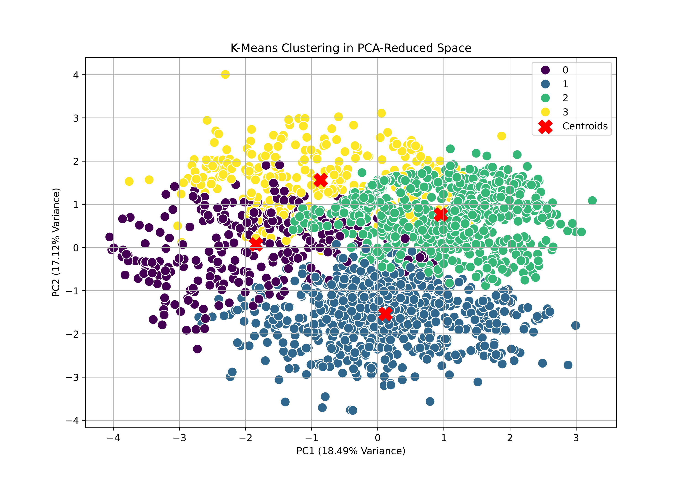

# Factors Impacting Obesity Rates in Latin America
_A supervised & unsupervised machine‐learning analysis of UCI obesity data_


## Project Overview
Analysis of factors contributing to obesity in Latin American countries using multivariate statistical techniques. This study combines exploratory data analysis, K-means clustering, and decision trees to identify patterns and predictors of obesity rates. The results show how obesity risk varies across subpopulations defined by both lifestyle and demographic factors. Key findings include the complex interplay between physical activity, technology use, dietary habits, and family history as determinants of obesity risk.

*Completed as part of MSc in Applied Statistics, University of Strathclyde.*



## Installation and Setup

```bash
# Clone repository
git clone https://github.com/yourusername/obesity-in-latin-america.git
cd obesity-in-latin-america

# Create and activate virtual environment (optional)
python -m venv venv
source venv/bin/activate  # On Windows: venv\Scripts\activate

# Install dependencies
pip install pandas numpy matplotlib seaborn scikit-learn jupyter
```

## Requirements
- Python 3.12
- The dataset is included in the data/ directory

## Data
Dataset from [UCI Machine Learning Repository](https://archive.ics.uci.edu/dataset/544/estimation+of+obesity+levels+based+on+eating+habits+and+physical+condition) with 2111 observations across 17 variables from participants in Mexico, Peru, and Colombia. Variables include demographic information, dietary habits, physical activity levels, and technology use. The target variable categorizes individuals by BMI.

## Code Structure
```
obesity-in-latin-america/
├── README.md                # Project documentation
├── data/                    # Data file
├── docs/                    # Written report
├── notebooks/               # Jupyter notebooks for analysis
│   ├── 01_initial_data_exploration.ipynb
│   ├── 02_multivariate_analysis.ipynb
│   ├── 03_exploratory_unsupervised.ipynb
│   ├── 04_supervised_analysis.ipynb
```

## Analysis
1. **Exploratory Data Analysis**: Correlation analysis and visualization of relationships between variables and obesity
2. **Unsupervised Learning**: K-means clustering with PCA to identify natural groupings
3. **Supervised Learning**: Decision tree classification to identify key predictors

Technologies: Python 3.12, scikit-learn, pandas, matplotlib, seaborn

## Results
Key findings:
- Family history, frequent snacking, and high-calorie food consumption strongly associated with obesity
- Screen time negatively correlated with physical activity and predicted higher obesity risk
- Public transportation usage frequently appeared in obesity risk profiles
- Complex relationship between vegetable consumption and obesity when combined with sedentary behaviors

## Acknowledgements
University of Strathclyde and UCI Machine Learning Repository

---
<!-- Metadata for Jekyll/GitHub Pages -->
<!--
layout: project
title: "Factors Impacting Obesity Rates in Latin America"
date: 2025-03-02
thumbnail: "docs/assets/thumbnail.png"
categories: [msc, statistics, machine-learning, health]
tags: [clustering, decision-trees, exploratory-analysis, obesity, latin-america]
project_type: academic
course: "CS818 - MSc in Applied Statistics"
abstract: "This study employs machine learning techniques to explore the multifactorial nature of obesity, analyzing data from Mexico, Peru, and Colombia to identify key lifestyle factors associated with obesity and their interrelationships."
-->
